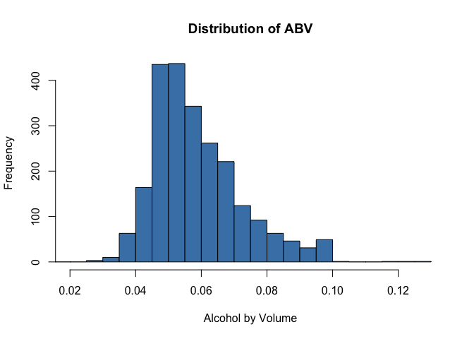
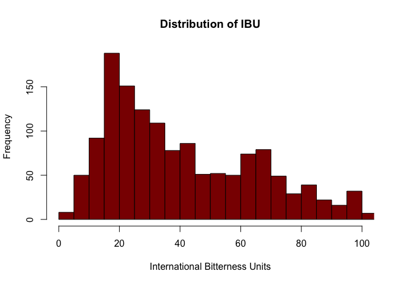
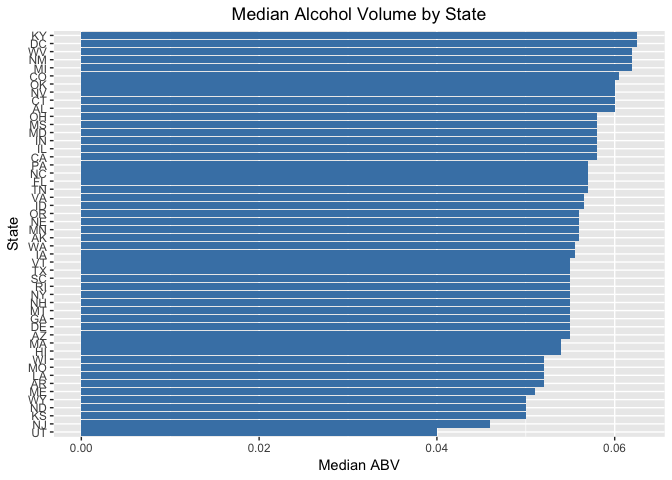
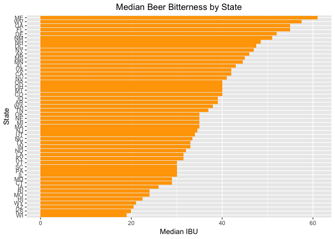
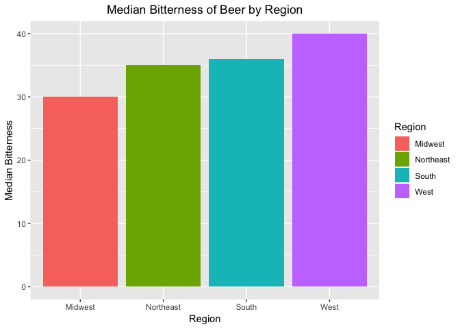
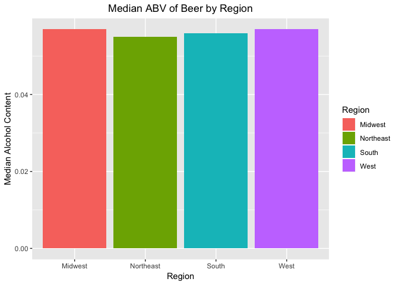
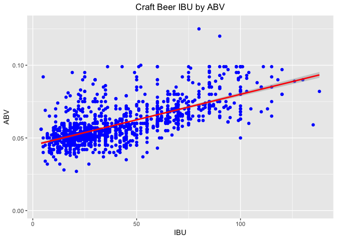
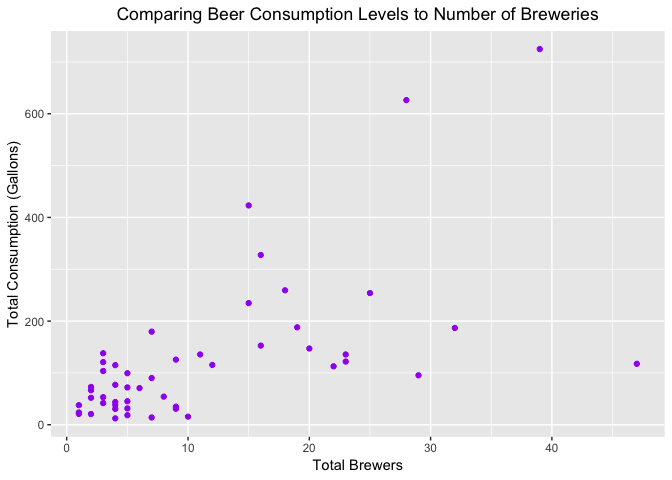

## XYZ Brewery Proposal

### Introduction
According to [Fortune](http://fortune.com/2018/03/27/craft-beer-2017-sales/) the US Craft Brew industry was worth $26 billion dollars in 2017, an increase of $6.2 billion since 2015.  While the pace of growth is slowing, opportunity is still large.  It's known that craft beer drinkers tend to support local independent breweries, and consumers are becoming more selective.  Furthermore there is [rising demand](https://www.grandviewresearch.com/press-release/global-craft-beer-market) for low alcohol by volume (ABV) and flavored beer.  Each market share of .5%  is equivalent to $130 million in revenue.

As a start-up XYZ faces a saturated market.  There are two purposes of this research, first of which is to examine the current landscape and scope out under-served areas in the US where few breweries exist.   Second is to understand what beer preference(s) would be most profitable should a brewery (or breweries) be built.  [Craftbeer](https://www.craftbeer.com/craft-beer-muses/craft-beer-by-the-numbers) reports that four key statistics are used to describe craft beers:

**1)** Serving size

**2)** International Bitterness Units (IBU): the bitterness element of a beer's flavor

**3)** Alcohol by Volume (ABV): higher values increase the complexity and flavor of the beer

**4)** Original Gravity / Final Gravity: factors which affect ABV and sensory intensity

This report will focus on IBU and ABV. It will also integrate data on drinking consumption by state to clarify each state's drinking behavior.

### Competitive Landscape: How many craft breweries are currently producing in the US?

The relevant datasets are *Beers.csv* and *Breweries.csv*.  Each will be loaded each into R after setting a working a directory.


```r
setwd("/Users/roberthazell/Desktop/DataScience@SMU/DoingDataScience/CaseStudy1")
beers <- read.csv("beers.csv")
brewers <- read.csv("breweries.csv")
```

The total number of breweries can be found be inspecting the ```State``` column of ```brewers```.  There are 558 unique breweries in the U.S.


```r
length(brewers$State)
```

```
[1] 558
```

### Combining data sources to better understand US craft brewing

By merging the *beers* and *brewers* datasets, a more complete picture of the US beer landscape is possible.  Each dataset will be merged on their common *id* columns.  This is ```Brewery_id``` and ```Brew_ID```, which are equivalent.


```r
Brewtot <- merge(beers, brewers, by.x = "Brewery_id", by.y = "Brew_ID")
```

Here is a look at the first six rows of the merged data, as there are over 2000 rows in the dataset.


```r
nrow(Brewtot) # number of rows
```

```
[1] 2410
```

```r
head(Brewtot) # first six observations
```

```
  Brewery_id        Name.x Beer_ID   ABV IBU
1          1  Get Together    2692 0.045  50
2          1 Maggie's Leap    2691 0.049  26
3          1    Wall's End    2690 0.048  19
4          1       Pumpion    2689 0.060  38
5          1    Stronghold    2688 0.060  25
6          1   Parapet ESB    2687 0.056  47
                                Style Ounces             Name.y
1                        American IPA     16 NorthGate Brewing 
2                  Milk / Sweet Stout     16 NorthGate Brewing 
3                   English Brown Ale     16 NorthGate Brewing 
4                         Pumpkin Ale     16 NorthGate Brewing 
5                     American Porter     16 NorthGate Brewing 
6 Extra Special / Strong Bitter (ESB)     16 NorthGate Brewing 
         City State
1 Minneapolis    MN
2 Minneapolis    MN
3 Minneapolis    MN
4 Minneapolis    MN
5 Minneapolis    MN
6 Minneapolis    MN
```

Renaming ```Name.x``` and ```Name.y``` increases clarity. They will represent the ```Beer``` name and ```Brewer```, respectively.


```r
colnames(Brewtot)[c(2,8)] = c("Beer", "Brewer")
```

### Missing Information

Before further analyzing the data it's best to see if any missing values (```NA```) exist.


```r
Brewtot_Missing <- sapply(Brewtot, function(x) sum(is.na(x)))
Brewtot_Missing
```

```
Brewery_id       Beer    Beer_ID        ABV        IBU      Style 
         0          0          0         62       1005          0 
    Ounces     Brewer       City      State 
         0          0          0          0 
```

On the two important metrics ```ABV``` and ```IBU```, there are 62 and 1005 missing values respectively.  This means our data may have limitations, namely it may not be completely representative of the entire brewing industry. As will be shown later, however, there is much utility still.

### Market Saturation

In determining where to build any brewery, it's advisable to avoid states with many breweries already.  To that end, the merged dataset ```Brewtot``` can be used to summarize the total number of unique brews and brewers per state.


```r
library(dplyr)
library(kableExtra)

beer_landscape <- Brewtot %>% group_by(State) %>% summarise(Beers = length(Beer)) %>% cbind(brewers %>% group_by(State) %>% summarise(`Total Brewers` = length(State)) %>% select(`Total Brewers`)) %>% arrange(desc(`Total Brewers`)) %>% data.frame()
beer_landscape$State <- trimws(beer_landscape$State)

str(beer_landscape)
```

```
'data.frame':	51 obs. of  3 variables:
 $ State        : chr  "CO" "CA" "MI" "OR" ...
 $ Beers        : int  265 183 162 125 130 100 82 68 139 87 ...
 $ Total.Brewers: int  47 39 32 29 28 25 23 23 22 20 ...
```

```r
kable(beer_landscape, align = rep('c',3)) %>% kable_styling(bootstrap_options = "striped", full_width = F)
```

<table class="table table-striped" style="width: auto !important; margin-left: auto; margin-right: auto;">
 <thead>
  <tr>
   <th style="text-align:center;"> State </th>
   <th style="text-align:center;"> Beers </th>
   <th style="text-align:center;"> Total.Brewers </th>
  </tr>
 </thead>
<tbody>
  <tr>
   <td style="text-align:center;"> CO </td>
   <td style="text-align:center;"> 265 </td>
   <td style="text-align:center;"> 47 </td>
  </tr>
  <tr>
   <td style="text-align:center;"> CA </td>
   <td style="text-align:center;"> 183 </td>
   <td style="text-align:center;"> 39 </td>
  </tr>
  <tr>
   <td style="text-align:center;"> MI </td>
   <td style="text-align:center;"> 162 </td>
   <td style="text-align:center;"> 32 </td>
  </tr>
  <tr>
   <td style="text-align:center;"> OR </td>
   <td style="text-align:center;"> 125 </td>
   <td style="text-align:center;"> 29 </td>
  </tr>
  <tr>
   <td style="text-align:center;"> TX </td>
   <td style="text-align:center;"> 130 </td>
   <td style="text-align:center;"> 28 </td>
  </tr>
  <tr>
   <td style="text-align:center;"> PA </td>
   <td style="text-align:center;"> 100 </td>
   <td style="text-align:center;"> 25 </td>
  </tr>
  <tr>
   <td style="text-align:center;"> MA </td>
   <td style="text-align:center;"> 82 </td>
   <td style="text-align:center;"> 23 </td>
  </tr>
  <tr>
   <td style="text-align:center;"> WA </td>
   <td style="text-align:center;"> 68 </td>
   <td style="text-align:center;"> 23 </td>
  </tr>
  <tr>
   <td style="text-align:center;"> IN </td>
   <td style="text-align:center;"> 139 </td>
   <td style="text-align:center;"> 22 </td>
  </tr>
  <tr>
   <td style="text-align:center;"> WI </td>
   <td style="text-align:center;"> 87 </td>
   <td style="text-align:center;"> 20 </td>
  </tr>
  <tr>
   <td style="text-align:center;"> NC </td>
   <td style="text-align:center;"> 59 </td>
   <td style="text-align:center;"> 19 </td>
  </tr>
  <tr>
   <td style="text-align:center;"> IL </td>
   <td style="text-align:center;"> 91 </td>
   <td style="text-align:center;"> 18 </td>
  </tr>
  <tr>
   <td style="text-align:center;"> NY </td>
   <td style="text-align:center;"> 74 </td>
   <td style="text-align:center;"> 16 </td>
  </tr>
  <tr>
   <td style="text-align:center;"> VA </td>
   <td style="text-align:center;"> 40 </td>
   <td style="text-align:center;"> 16 </td>
  </tr>
  <tr>
   <td style="text-align:center;"> FL </td>
   <td style="text-align:center;"> 58 </td>
   <td style="text-align:center;"> 15 </td>
  </tr>
  <tr>
   <td style="text-align:center;"> OH </td>
   <td style="text-align:center;"> 49 </td>
   <td style="text-align:center;"> 15 </td>
  </tr>
  <tr>
   <td style="text-align:center;"> MN </td>
   <td style="text-align:center;"> 55 </td>
   <td style="text-align:center;"> 12 </td>
  </tr>
  <tr>
   <td style="text-align:center;"> AZ </td>
   <td style="text-align:center;"> 47 </td>
   <td style="text-align:center;"> 11 </td>
  </tr>
  <tr>
   <td style="text-align:center;"> VT </td>
   <td style="text-align:center;"> 27 </td>
   <td style="text-align:center;"> 10 </td>
  </tr>
  <tr>
   <td style="text-align:center;"> ME </td>
   <td style="text-align:center;"> 27 </td>
   <td style="text-align:center;"> 9 </td>
  </tr>
  <tr>
   <td style="text-align:center;"> MO </td>
   <td style="text-align:center;"> 42 </td>
   <td style="text-align:center;"> 9 </td>
  </tr>
  <tr>
   <td style="text-align:center;"> MT </td>
   <td style="text-align:center;"> 40 </td>
   <td style="text-align:center;"> 9 </td>
  </tr>
  <tr>
   <td style="text-align:center;"> CT </td>
   <td style="text-align:center;"> 27 </td>
   <td style="text-align:center;"> 8 </td>
  </tr>
  <tr>
   <td style="text-align:center;"> AK </td>
   <td style="text-align:center;"> 25 </td>
   <td style="text-align:center;"> 7 </td>
  </tr>
  <tr>
   <td style="text-align:center;"> GA </td>
   <td style="text-align:center;"> 16 </td>
   <td style="text-align:center;"> 7 </td>
  </tr>
  <tr>
   <td style="text-align:center;"> MD </td>
   <td style="text-align:center;"> 21 </td>
   <td style="text-align:center;"> 7 </td>
  </tr>
  <tr>
   <td style="text-align:center;"> OK </td>
   <td style="text-align:center;"> 19 </td>
   <td style="text-align:center;"> 6 </td>
  </tr>
  <tr>
   <td style="text-align:center;"> IA </td>
   <td style="text-align:center;"> 30 </td>
   <td style="text-align:center;"> 5 </td>
  </tr>
  <tr>
   <td style="text-align:center;"> ID </td>
   <td style="text-align:center;"> 30 </td>
   <td style="text-align:center;"> 5 </td>
  </tr>
  <tr>
   <td style="text-align:center;"> LA </td>
   <td style="text-align:center;"> 19 </td>
   <td style="text-align:center;"> 5 </td>
  </tr>
  <tr>
   <td style="text-align:center;"> NE </td>
   <td style="text-align:center;"> 25 </td>
   <td style="text-align:center;"> 5 </td>
  </tr>
  <tr>
   <td style="text-align:center;"> RI </td>
   <td style="text-align:center;"> 27 </td>
   <td style="text-align:center;"> 5 </td>
  </tr>
  <tr>
   <td style="text-align:center;"> HI </td>
   <td style="text-align:center;"> 27 </td>
   <td style="text-align:center;"> 4 </td>
  </tr>
  <tr>
   <td style="text-align:center;"> KY </td>
   <td style="text-align:center;"> 21 </td>
   <td style="text-align:center;"> 4 </td>
  </tr>
  <tr>
   <td style="text-align:center;"> NM </td>
   <td style="text-align:center;"> 14 </td>
   <td style="text-align:center;"> 4 </td>
  </tr>
  <tr>
   <td style="text-align:center;"> SC </td>
   <td style="text-align:center;"> 14 </td>
   <td style="text-align:center;"> 4 </td>
  </tr>
  <tr>
   <td style="text-align:center;"> UT </td>
   <td style="text-align:center;"> 26 </td>
   <td style="text-align:center;"> 4 </td>
  </tr>
  <tr>
   <td style="text-align:center;"> WY </td>
   <td style="text-align:center;"> 15 </td>
   <td style="text-align:center;"> 4 </td>
  </tr>
  <tr>
   <td style="text-align:center;"> AL </td>
   <td style="text-align:center;"> 10 </td>
   <td style="text-align:center;"> 3 </td>
  </tr>
  <tr>
   <td style="text-align:center;"> KS </td>
   <td style="text-align:center;"> 23 </td>
   <td style="text-align:center;"> 3 </td>
  </tr>
  <tr>
   <td style="text-align:center;"> NH </td>
   <td style="text-align:center;"> 8 </td>
   <td style="text-align:center;"> 3 </td>
  </tr>
  <tr>
   <td style="text-align:center;"> NJ </td>
   <td style="text-align:center;"> 8 </td>
   <td style="text-align:center;"> 3 </td>
  </tr>
  <tr>
   <td style="text-align:center;"> TN </td>
   <td style="text-align:center;"> 6 </td>
   <td style="text-align:center;"> 3 </td>
  </tr>
  <tr>
   <td style="text-align:center;"> AR </td>
   <td style="text-align:center;"> 5 </td>
   <td style="text-align:center;"> 2 </td>
  </tr>
  <tr>
   <td style="text-align:center;"> DE </td>
   <td style="text-align:center;"> 2 </td>
   <td style="text-align:center;"> 2 </td>
  </tr>
  <tr>
   <td style="text-align:center;"> MS </td>
   <td style="text-align:center;"> 11 </td>
   <td style="text-align:center;"> 2 </td>
  </tr>
  <tr>
   <td style="text-align:center;"> NV </td>
   <td style="text-align:center;"> 11 </td>
   <td style="text-align:center;"> 2 </td>
  </tr>
  <tr>
   <td style="text-align:center;"> DC </td>
   <td style="text-align:center;"> 8 </td>
   <td style="text-align:center;"> 1 </td>
  </tr>
  <tr>
   <td style="text-align:center;"> ND </td>
   <td style="text-align:center;"> 3 </td>
   <td style="text-align:center;"> 1 </td>
  </tr>
  <tr>
   <td style="text-align:center;"> SD </td>
   <td style="text-align:center;"> 7 </td>
   <td style="text-align:center;"> 1 </td>
  </tr>
  <tr>
   <td style="text-align:center;"> WV </td>
   <td style="text-align:center;"> 2 </td>
   <td style="text-align:center;"> 1 </td>
  </tr>
</tbody>
</table>

From this we see Colorado has the highest number of beers and breweries.  So XYZ should probably avoid that state!

### General Differences in Beer Characteristics

Before looking at state and regional differences in IBU and ABV, an overall view of their distribution is helpful.


```r
hist(Brewtot$ABV, main="Distribution of ABV", breaks=20, xlab="Alcohol by Volume", border="black", col="steel blue", xlim=c(.02,.13)) 
```

<!-- -->

```r
hist(Brewtot$IBU, main="Distribution of IBU", breaks=20, xlab="International Bitterness Units", border="black", col="dark red", xlim=c(0,100))
```

<!-- -->

ABV is mostly centered around .05, with a moderate right skew.  On the other hand, IBU has a strong right skew.  In spite of the peak at ~ 20 IBU, a lot of beers have a bitter side, too.

### State Differences in Beer Characteristics

Perhaps ABV and/or IBU stabilizes when *median* values are examined.  That data needs gathering first.


```r
alcohol_and_bitterness <- Brewtot %>% group_by(State) %>% 
  summarise(MedianAlcohol = median(ABV, na.rm = T), MedianBitter = median(IBU, na.rm = T))
```

South Dakota has absolutely no information on bitterness for their beers, so it will be deleted.


```r
alcohol_and_bitterness <- alcohol_and_bitterness[-42,]
```

Here are the median distributions for IBU and ABV by state.


```r
library(ggplot2)

ggplot(alcohol_and_bitterness) + 
  geom_col(aes(x = reorder(State, MedianAlcohol), y = MedianAlcohol), fill = 'steel blue') + coord_flip() + ylab("Median ABV") + xlab("State") + ggtitle("Median Alcohol Volume by State") + theme(plot.title = element_text(hjust = 0.5))
```

<!-- -->

```r
ggplot(alcohol_and_bitterness) + 
  geom_col(aes(x = reorder(State, MedianBitter), y = MedianBitter), fill = 'orange') + coord_flip() + ylab("Median IBU") + xlab("State") + ggtitle("Median Beer Bitterness by State") +  theme(plot.title = element_text(hjust = 0.5))
```

<!-- -->

This confirms the assumption that at least one of the variables stabilize when median values are examined (in this case, ABV).  Nevertheless, median IBU still displays significant variation, with Maine featuring a median IBU more than triple that of Wisconsin's.  

### Regional Differences in Beer Characteristics

What if median bitterness of beer brewed different at a regional level?  Let's test this claim.

First, define the four US regions according to the [Census Bureau's](https://www.businessinsider.com/regions-of-united-states-2018-5) standards.


```r
northeast = c('ME', 'NH', 'VT', 'MA', 'RI', 'CT', 'NY', 'NJ', 'PA')
midwest = c('ND', 'SD', 'NE', 'KS', 'MN', 'IA', 'MO', 'WI', 'IL', 'MI', 'IN', 'OH')
south = c('DE', 'MD', 'VA', 'WV', 'KY', 'NC', 'SC', 'TN', 'GA', 'FL', 'AL', 'MS', 'AR', 'LA', 'TX', 'OK')
west = c('WA', 'OR', 'ID', 'MT', 'WY', 'CA', 'NV', 'UT', 'AZ', 'CO', 'NM', 'AK', 'HI')
```

Something worth noting is that whitespace needs to be removed from the ```State``` column of ```Brewtot```.  Take a look at ```Brewtot```'s structure.


```r
str(Brewtot)
```

```
'data.frame':	2410 obs. of  10 variables:
 $ Brewery_id: int  1 1 1 1 1 1 2 2 2 2 ...
 $ Beer      : Factor w/ 2305 levels "#001 Golden Amber Lager",..: 802 1258 2185 1640 1926 1525 458 1218 43 71 ...
 $ Beer_ID   : int  2692 2691 2690 2689 2688 2687 2686 2685 2684 2683 ...
 $ ABV       : num  0.045 0.049 0.048 0.06 0.06 0.056 0.08 0.125 0.077 0.042 ...
 $ IBU       : int  50 26 19 38 25 47 68 80 25 42 ...
 $ Style     : Factor w/ 100 levels "","Abbey Single Ale",..: 16 77 48 83 22 57 12 46 77 18 ...
 $ Ounces    : num  16 16 16 16 16 16 16 16 16 16 ...
 $ Brewer    : Factor w/ 551 levels "10 Barrel Brewing Company",..: 355 355 355 355 355 355 12 12 12 12 ...
 $ City      : Factor w/ 384 levels "Abingdon","Abita Springs",..: 228 228 228 228 228 228 200 200 200 200 ...
 $ State     : Factor w/ 51 levels " AK"," AL"," AR",..: 24 24 24 24 24 24 18 18 18 18 ...
```

Looking closely at ```State```, one can see each state abbreviation has a blank space to the far left.  That'll be removed first, and then the ```Brewtot``` will be categorized by state.


```r
Brewtot$State <- trimws(Brewtot$State, which = "left")
Brewtot = Brewtot %>% mutate(Region = ifelse(State %in% northeast, 'Northeast',
                                          ifelse(State %in% midwest, 'Midwest',
                                          ifelse(State %in% south, 'South', 'West')))
                    )
```

Here are 10 random rows from the 'regionalized' dataset.  Only ```Beer```, ```Brewer```, ```State```, and ```Region``` columns are selected.


```r
set.seed(101)
Brewtot %>% select(c(Beer, Brewer, State, Region)) %>% 
  sample_n(10) %>% kable(align = rep('c',4)) %>% kable_styling(bootstrap_options = "striped", full_width = F)
```

<table class="table table-striped" style="width: auto !important; margin-left: auto; margin-right: auto;">
 <thead>
  <tr>
   <th style="text-align:center;"> Beer </th>
   <th style="text-align:center;"> Brewer </th>
   <th style="text-align:center;"> State </th>
   <th style="text-align:center;"> Region </th>
  </tr>
 </thead>
<tbody>
  <tr>
   <td style="text-align:center;"> Oakshire Amber Ale </td>
   <td style="text-align:center;"> Oakshire Brewing </td>
   <td style="text-align:center;"> OR </td>
   <td style="text-align:center;"> West </td>
  </tr>
  <tr>
   <td style="text-align:center;"> Plow Horse Belgian Style Imperial Stout </td>
   <td style="text-align:center;"> Brewery Vivant </td>
   <td style="text-align:center;"> MI </td>
   <td style="text-align:center;"> Midwest </td>
  </tr>
  <tr>
   <td style="text-align:center;"> Be Hoppy IPA </td>
   <td style="text-align:center;"> Wormtown Brewery </td>
   <td style="text-align:center;"> MA </td>
   <td style="text-align:center;"> Northeast </td>
  </tr>
  <tr>
   <td style="text-align:center;"> Quarter Mile Double IPA </td>
   <td style="text-align:center;"> Blue Hills Brewery </td>
   <td style="text-align:center;"> MA </td>
   <td style="text-align:center;"> Northeast </td>
  </tr>
  <tr>
   <td style="text-align:center;"> Pure Fury </td>
   <td style="text-align:center;"> Rhinegeist Brewery </td>
   <td style="text-align:center;"> OH </td>
   <td style="text-align:center;"> Midwest </td>
  </tr>
  <tr>
   <td style="text-align:center;"> Ray Ray’s Pale Ale </td>
   <td style="text-align:center;"> Center of the Universe Brewing C... </td>
   <td style="text-align:center;"> VA </td>
   <td style="text-align:center;"> South </td>
  </tr>
  <tr>
   <td style="text-align:center;"> Sky-Five </td>
   <td style="text-align:center;"> Bauhaus Brew Labs </td>
   <td style="text-align:center;"> MN </td>
   <td style="text-align:center;"> Midwest </td>
  </tr>
  <tr>
   <td style="text-align:center;"> Hipster Breakfast </td>
   <td style="text-align:center;"> Southern Prohibition Brewing Com... </td>
   <td style="text-align:center;"> MS </td>
   <td style="text-align:center;"> South </td>
  </tr>
  <tr>
   <td style="text-align:center;"> Block Party Robust Porter </td>
   <td style="text-align:center;"> Four Corners Brewing Company </td>
   <td style="text-align:center;"> TX </td>
   <td style="text-align:center;"> South </td>
  </tr>
  <tr>
   <td style="text-align:center;"> Weize Guy </td>
   <td style="text-align:center;"> Joseph James Brewing Company </td>
   <td style="text-align:center;"> NV </td>
   <td style="text-align:center;"> West </td>
  </tr>
</tbody>
</table>

Now the median IBU and ABV values will be plotted as a bar chart.


```r
alcohol_and_bitterness_regionalized <- Brewtot %>% select(c(Beer, Brewer, State, Region, ABV, IBU)) %>% 
  group_by(Region) %>% summarise(MedianAlcohol = median(ABV, na.rm = T), MedianBitter = median(IBU, na.rm = T))

alcohol_and_bitterness_regionalized$Region <- as.factor(alcohol_and_bitterness_regionalized$Region)

ggplot(alcohol_and_bitterness_regionalized) + geom_col(aes(Region, MedianBitter, fill = Region)) + ggtitle("Median Bitterness of Beer by Region") + ylab("Median Bitterness") + theme(plot.title = element_text(hjust = 0.5))
```

<!-- -->

```r
ggplot(alcohol_and_bitterness_regionalized) + geom_col(aes(Region, MedianAlcohol, fill = Region)) + ggtitle("Median ABV of Beer by Region") + ylab("Median Alcohol Content") + theme(plot.title = element_text(hjust = 0.5))
```

<!-- -->

Median ABV values look constant by region, but some differences in median bitterness (IBU) exists across region.  Midwestern beers seem the least bitter while Western beers are bitter by far.  

### Relationship between ABV and IBU

Much discussion has been given to these beer characteristics above, but is there any correlation between these variables?  Here's a scatterplot comparing them.


```r
ggplot(data=Brewtot, aes(x=IBU, y=ABV)) +geom_point(shape = 16, size = 2, color="blue") + stat_smooth(method = 'lm', color='red') + labs(title = 'Craft Beer IBU by ABV') + theme(plot.title = element_text(hjust = 0.5))
```

<!-- -->

There is a moderate linear correlation.  A Pearson correlation test quantifies it.


```r
cor.test( ~ ABV + IBU,data=Brewtot,method = "pearson")
```

```

	Pearson's product-moment correlation

data:  ABV and IBU
t = 33.863, df = 1403, p-value < 2.2e-16
alternative hypothesis: true correlation is not equal to 0
95 percent confidence interval:
 0.6407982 0.6984238
sample estimates:
      cor 
0.6706215 
```

At *r* = 0.67, this is indeed moderate, but not strong, positive correlation. The regression line illustrates that the variability may be changing along the prediction line (heteroscedasticity).  This correlation does not show causation as the relationship may be affect by third variables such as ingredients used, fermentation process, and marketing needs.

### Integrating Beer Consumption

It's plausible to think that states with higher numbers of brewers or beers have higher beer consumption.  To investigate this assumption, 2018 [data](https://www.usatoday.com/story/money/personalfinance/2018/05/02/which-states-residents-drink-most-beer/569430002/) on total annual beer consumption (in gallons) by state is taken.  

Note that the year for the ```beer``` and ```brewers``` data is unknown, but we'll assume the general trend of data has not changed significantly even if the data are a couple of years apart.


```r
library(rvest)
library(stringr)

# scrape consumption info
scraping_beer <- read_html("https://www.usatoday.com/story/money/personalfinance/2018/05/02/which-states-residents-drink-most-beer/569430002/")
national_consum <- scraping_beer %>% html_nodes("ul") %>% html_text() %>% data.frame()
colnames(national_consum)[1] <- "Total Consumption"
# remove first four rows (irrelevant info)
# use drop = FALSE since there's only 1 column
national_consum <- national_consum[-c(1:4), , drop = FALSE]
# change column from factor to string (character)
national_consum$`Total Consumption` <- as.character(national_consum$`Total Consumption`)

beer_values = c() # holds the actual consumption values
for (row in national_consum){
  total_consum <- substring(row, first = str_locate(row, "Total")[1], last = str_locate(row, "5 yr.")[1] - 1)
  total_consum_numeric <- regmatches(total_consum, regexpr('\\d+\\.+\\d', total_consum)) %>% as.numeric()
  beer_values <- c(beer_values, total_consum_numeric)
}

# make the beer values the column values of nationa_consum
national_consum$`Total Consumption` <- beer_values
# remove row names bc of improper numbering
rownames(national_consum) <- NULL


# scrape the name of the states
statenames <- scraping_beer %>% html_nodes("p") %>% html_text() %>% data.frame()
# remove row names
colnames(statenames)[1] <- 'State'
statenames$State <- as.character(statenames$State)
rownames(statenames) <- NULL
# immediately delete irrelevant first 22 and last 4 rows
statenames <- statenames[-c(1:22, 88:91), 1, drop = FALSE]
# first isolate rows similar in format to "46. New York"
statenames <- statenames[grepl("\\d+\\.", statenames$State), , drop = FALSE]
# remove list numbers and "(tied)"
statenames$State <- str_replace_all(statenames$State, "\\d+\\.|\\(+tied+\\)", "")
# remove spaces before or after name
statenames$State <- str_replace_all(statenames$State, "^\\s|\\s$", "")
rownames(statenames) <- NULL
# convert to abbreviations using state.name and state.abb built-ins
for (i in 1:nrow(statenames)) {
  statenames$State[i] <- state.abb[grep(statenames$State[i], state.name)]
}
# merge statenames and national_consum to a unified dataset
national_consum <- cbind(national_consum, statenames)
#merge national_consum and beer_landscape for the total dataset
complete_beer_landscape <- merge(national_consum, beer_landscape, by = 'State') %>%
  arrange(desc(`Total Consumption`))
colnames(complete_beer_landscape)[4] <- "Total Brewers"
# format table
kable(complete_beer_landscape, align = rep('c',4)) %>% kable_styling(bootstrap_options = "striped", full_width = F)
```

<table class="table table-striped" style="width: auto !important; margin-left: auto; margin-right: auto;">
 <thead>
  <tr>
   <th style="text-align:center;"> State </th>
   <th style="text-align:center;"> Total Consumption </th>
   <th style="text-align:center;"> Beers </th>
   <th style="text-align:center;"> Total Brewers </th>
  </tr>
 </thead>
<tbody>
  <tr>
   <td style="text-align:center;"> CA </td>
   <td style="text-align:center;"> 724.9 </td>
   <td style="text-align:center;"> 183 </td>
   <td style="text-align:center;"> 39 </td>
  </tr>
  <tr>
   <td style="text-align:center;"> TX </td>
   <td style="text-align:center;"> 626.3 </td>
   <td style="text-align:center;"> 130 </td>
   <td style="text-align:center;"> 28 </td>
  </tr>
  <tr>
   <td style="text-align:center;"> FL </td>
   <td style="text-align:center;"> 423.1 </td>
   <td style="text-align:center;"> 58 </td>
   <td style="text-align:center;"> 15 </td>
  </tr>
  <tr>
   <td style="text-align:center;"> NY </td>
   <td style="text-align:center;"> 327.5 </td>
   <td style="text-align:center;"> 74 </td>
   <td style="text-align:center;"> 16 </td>
  </tr>
  <tr>
   <td style="text-align:center;"> IL </td>
   <td style="text-align:center;"> 259.4 </td>
   <td style="text-align:center;"> 91 </td>
   <td style="text-align:center;"> 18 </td>
  </tr>
  <tr>
   <td style="text-align:center;"> PA </td>
   <td style="text-align:center;"> 254.1 </td>
   <td style="text-align:center;"> 100 </td>
   <td style="text-align:center;"> 25 </td>
  </tr>
  <tr>
   <td style="text-align:center;"> OH </td>
   <td style="text-align:center;"> 234.7 </td>
   <td style="text-align:center;"> 49 </td>
   <td style="text-align:center;"> 15 </td>
  </tr>
  <tr>
   <td style="text-align:center;"> NC </td>
   <td style="text-align:center;"> 188.0 </td>
   <td style="text-align:center;"> 59 </td>
   <td style="text-align:center;"> 19 </td>
  </tr>
  <tr>
   <td style="text-align:center;"> MI </td>
   <td style="text-align:center;"> 186.7 </td>
   <td style="text-align:center;"> 162 </td>
   <td style="text-align:center;"> 32 </td>
  </tr>
  <tr>
   <td style="text-align:center;"> GA </td>
   <td style="text-align:center;"> 179.6 </td>
   <td style="text-align:center;"> 16 </td>
   <td style="text-align:center;"> 7 </td>
  </tr>
  <tr>
   <td style="text-align:center;"> VA </td>
   <td style="text-align:center;"> 152.7 </td>
   <td style="text-align:center;"> 40 </td>
   <td style="text-align:center;"> 16 </td>
  </tr>
  <tr>
   <td style="text-align:center;"> WI </td>
   <td style="text-align:center;"> 147.1 </td>
   <td style="text-align:center;"> 87 </td>
   <td style="text-align:center;"> 20 </td>
  </tr>
  <tr>
   <td style="text-align:center;"> NJ </td>
   <td style="text-align:center;"> 138.0 </td>
   <td style="text-align:center;"> 8 </td>
   <td style="text-align:center;"> 3 </td>
  </tr>
  <tr>
   <td style="text-align:center;"> AZ </td>
   <td style="text-align:center;"> 135.6 </td>
   <td style="text-align:center;"> 47 </td>
   <td style="text-align:center;"> 11 </td>
  </tr>
  <tr>
   <td style="text-align:center;"> WA </td>
   <td style="text-align:center;"> 135.6 </td>
   <td style="text-align:center;"> 68 </td>
   <td style="text-align:center;"> 23 </td>
  </tr>
  <tr>
   <td style="text-align:center;"> MO </td>
   <td style="text-align:center;"> 125.6 </td>
   <td style="text-align:center;"> 42 </td>
   <td style="text-align:center;"> 9 </td>
  </tr>
  <tr>
   <td style="text-align:center;"> MA </td>
   <td style="text-align:center;"> 121.9 </td>
   <td style="text-align:center;"> 82 </td>
   <td style="text-align:center;"> 23 </td>
  </tr>
  <tr>
   <td style="text-align:center;"> TN </td>
   <td style="text-align:center;"> 120.8 </td>
   <td style="text-align:center;"> 6 </td>
   <td style="text-align:center;"> 3 </td>
  </tr>
  <tr>
   <td style="text-align:center;"> CO </td>
   <td style="text-align:center;"> 117.6 </td>
   <td style="text-align:center;"> 265 </td>
   <td style="text-align:center;"> 47 </td>
  </tr>
  <tr>
   <td style="text-align:center;"> MN </td>
   <td style="text-align:center;"> 115.4 </td>
   <td style="text-align:center;"> 55 </td>
   <td style="text-align:center;"> 12 </td>
  </tr>
  <tr>
   <td style="text-align:center;"> SC </td>
   <td style="text-align:center;"> 115.0 </td>
   <td style="text-align:center;"> 14 </td>
   <td style="text-align:center;"> 4 </td>
  </tr>
  <tr>
   <td style="text-align:center;"> IN </td>
   <td style="text-align:center;"> 112.7 </td>
   <td style="text-align:center;"> 139 </td>
   <td style="text-align:center;"> 22 </td>
  </tr>
  <tr>
   <td style="text-align:center;"> AL </td>
   <td style="text-align:center;"> 103.7 </td>
   <td style="text-align:center;"> 10 </td>
   <td style="text-align:center;"> 3 </td>
  </tr>
  <tr>
   <td style="text-align:center;"> LA </td>
   <td style="text-align:center;"> 99.4 </td>
   <td style="text-align:center;"> 19 </td>
   <td style="text-align:center;"> 5 </td>
  </tr>
  <tr>
   <td style="text-align:center;"> OR </td>
   <td style="text-align:center;"> 95.4 </td>
   <td style="text-align:center;"> 125 </td>
   <td style="text-align:center;"> 29 </td>
  </tr>
  <tr>
   <td style="text-align:center;"> MD </td>
   <td style="text-align:center;"> 90.1 </td>
   <td style="text-align:center;"> 21 </td>
   <td style="text-align:center;"> 7 </td>
  </tr>
  <tr>
   <td style="text-align:center;"> KY </td>
   <td style="text-align:center;"> 77.1 </td>
   <td style="text-align:center;"> 21 </td>
   <td style="text-align:center;"> 4 </td>
  </tr>
  <tr>
   <td style="text-align:center;"> NV </td>
   <td style="text-align:center;"> 72.9 </td>
   <td style="text-align:center;"> 11 </td>
   <td style="text-align:center;"> 2 </td>
  </tr>
  <tr>
   <td style="text-align:center;"> IA </td>
   <td style="text-align:center;"> 72.0 </td>
   <td style="text-align:center;"> 30 </td>
   <td style="text-align:center;"> 5 </td>
  </tr>
  <tr>
   <td style="text-align:center;"> OK </td>
   <td style="text-align:center;"> 70.7 </td>
   <td style="text-align:center;"> 19 </td>
   <td style="text-align:center;"> 6 </td>
  </tr>
  <tr>
   <td style="text-align:center;"> MS </td>
   <td style="text-align:center;"> 66.6 </td>
   <td style="text-align:center;"> 11 </td>
   <td style="text-align:center;"> 2 </td>
  </tr>
  <tr>
   <td style="text-align:center;"> CT </td>
   <td style="text-align:center;"> 54.2 </td>
   <td style="text-align:center;"> 27 </td>
   <td style="text-align:center;"> 8 </td>
  </tr>
  <tr>
   <td style="text-align:center;"> KS </td>
   <td style="text-align:center;"> 53.2 </td>
   <td style="text-align:center;"> 23 </td>
   <td style="text-align:center;"> 3 </td>
  </tr>
  <tr>
   <td style="text-align:center;"> AR </td>
   <td style="text-align:center;"> 52.0 </td>
   <td style="text-align:center;"> 5 </td>
   <td style="text-align:center;"> 2 </td>
  </tr>
  <tr>
   <td style="text-align:center;"> NE </td>
   <td style="text-align:center;"> 45.3 </td>
   <td style="text-align:center;"> 25 </td>
   <td style="text-align:center;"> 5 </td>
  </tr>
  <tr>
   <td style="text-align:center;"> NM </td>
   <td style="text-align:center;"> 43.8 </td>
   <td style="text-align:center;"> 14 </td>
   <td style="text-align:center;"> 4 </td>
  </tr>
  <tr>
   <td style="text-align:center;"> NH </td>
   <td style="text-align:center;"> 41.8 </td>
   <td style="text-align:center;"> 8 </td>
   <td style="text-align:center;"> 3 </td>
  </tr>
  <tr>
   <td style="text-align:center;"> UT </td>
   <td style="text-align:center;"> 38.1 </td>
   <td style="text-align:center;"> 26 </td>
   <td style="text-align:center;"> 4 </td>
  </tr>
  <tr>
   <td style="text-align:center;"> WV </td>
   <td style="text-align:center;"> 37.8 </td>
   <td style="text-align:center;"> 2 </td>
   <td style="text-align:center;"> 1 </td>
  </tr>
  <tr>
   <td style="text-align:center;"> ME </td>
   <td style="text-align:center;"> 34.9 </td>
   <td style="text-align:center;"> 27 </td>
   <td style="text-align:center;"> 9 </td>
  </tr>
  <tr>
   <td style="text-align:center;"> ID </td>
   <td style="text-align:center;"> 31.5 </td>
   <td style="text-align:center;"> 30 </td>
   <td style="text-align:center;"> 5 </td>
  </tr>
  <tr>
   <td style="text-align:center;"> MT </td>
   <td style="text-align:center;"> 30.8 </td>
   <td style="text-align:center;"> 40 </td>
   <td style="text-align:center;"> 9 </td>
  </tr>
  <tr>
   <td style="text-align:center;"> HI </td>
   <td style="text-align:center;"> 30.6 </td>
   <td style="text-align:center;"> 27 </td>
   <td style="text-align:center;"> 4 </td>
  </tr>
  <tr>
   <td style="text-align:center;"> SD </td>
   <td style="text-align:center;"> 23.7 </td>
   <td style="text-align:center;"> 7 </td>
   <td style="text-align:center;"> 1 </td>
  </tr>
  <tr>
   <td style="text-align:center;"> ND </td>
   <td style="text-align:center;"> 20.9 </td>
   <td style="text-align:center;"> 3 </td>
   <td style="text-align:center;"> 1 </td>
  </tr>
  <tr>
   <td style="text-align:center;"> DE </td>
   <td style="text-align:center;"> 20.7 </td>
   <td style="text-align:center;"> 2 </td>
   <td style="text-align:center;"> 2 </td>
  </tr>
  <tr>
   <td style="text-align:center;"> RI </td>
   <td style="text-align:center;"> 18.4 </td>
   <td style="text-align:center;"> 27 </td>
   <td style="text-align:center;"> 5 </td>
  </tr>
  <tr>
   <td style="text-align:center;"> VT </td>
   <td style="text-align:center;"> 15.6 </td>
   <td style="text-align:center;"> 27 </td>
   <td style="text-align:center;"> 10 </td>
  </tr>
  <tr>
   <td style="text-align:center;"> AK </td>
   <td style="text-align:center;"> 14.0 </td>
   <td style="text-align:center;"> 25 </td>
   <td style="text-align:center;"> 7 </td>
  </tr>
  <tr>
   <td style="text-align:center;"> WY </td>
   <td style="text-align:center;"> 12.3 </td>
   <td style="text-align:center;"> 15 </td>
   <td style="text-align:center;"> 4 </td>
  </tr>
</tbody>
</table>

California, Texas, and Florida are the top three beer consuming states.

Here's a plot displaying the relationship between consumption and number of brewers.


```r
ggplot(complete_beer_landscape) + geom_point(aes(`Total Brewers`, `Total Consumption`), col = 'purple' )+ggtitle("Comparing Beer Consumption Levels to Number of Breweries") + xlab("Total Brewers") + ylab("Total Consumption (Gallons)") + theme(plot.title = element_text(hjust = 0.5))
```

<!-- -->

This confirms the idea that states with more brewers tend to drink more beer. A notable exception is Colorado, the state with a disproportionately high number of brewers but low overall consumption.


```r
complete_beer_landscape[which(complete_beer_landscape$`Total Brewers` > 40), ]
```

```
   State Total Consumption Beers Total Brewers
19    CO             117.6   265            47
```

### Conclusion

To maximize potential it is advisable to build breweries in states with few breweries but moderately high beer consumption.  Examples of such states include New Jersey, Tennessee, and South Carolina.  

With Tennessee, we can experiment with a more bitter beer with a flavorful raspberry twist.  Call it the *Tarty Tennesseean*.  An inital goal (a more conservative estimate) would be gaining at least 40% regional adoption within five years.   
